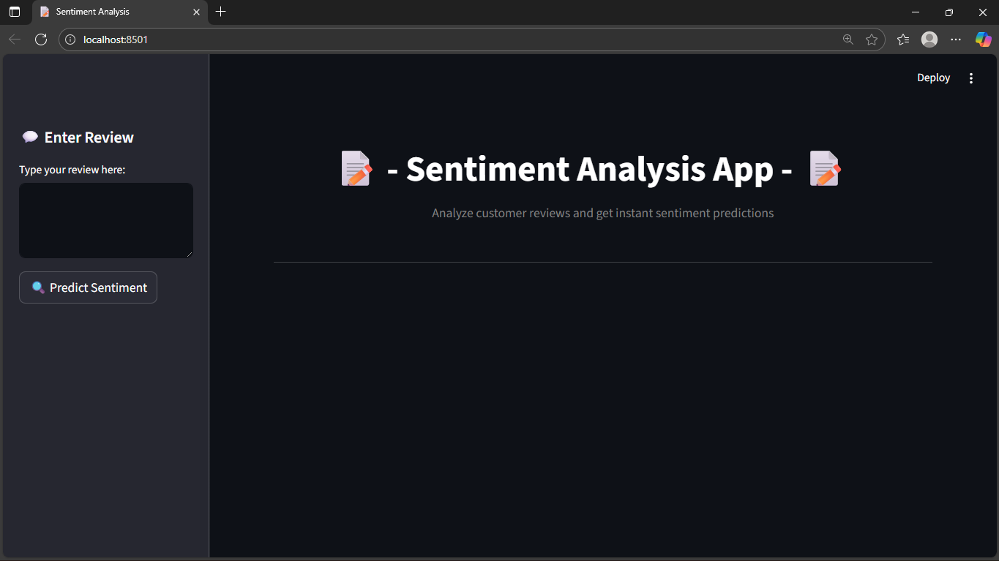
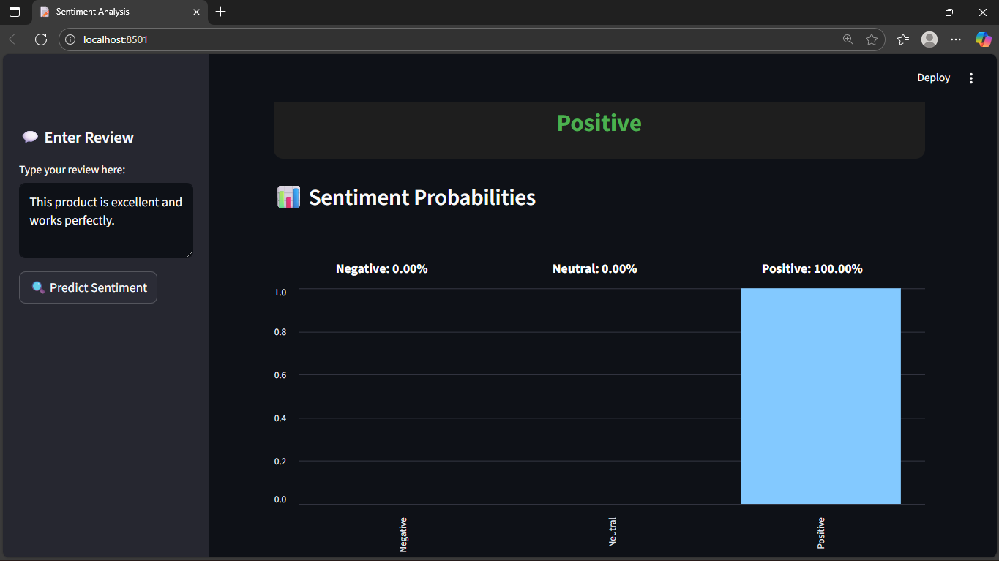
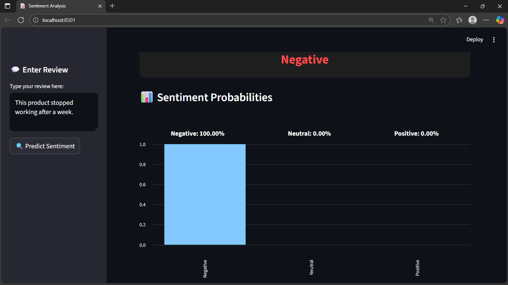

# 📝 Sentiment Analysis Web App

This project is an **end-to-end Sentiment Analysis System** that classifies customer reviews into **Positive**, **Neutral**, or **Negative** sentiments using a **Machine Learning model**.  
It includes both a **FastAPI backend** for prediction and a **Streamlit web interface** for user interaction and visualization.

---

## 🚀 Project Overview

The goal of this project is to automate the process of analyzing text data (such as product reviews or user feedback) and determining the overall sentiment behind it.  
This project demonstrates how **Machine Learning**, **FastAPI**, and **Streamlit** can work together to create a real-world NLP web application.

---

## 🧠 Key Features

✅ Real-time sentiment prediction for customer reviews  
✅ Interactive and clean Streamlit interface  
✅ REST API built using FastAPI  
✅ Displays probability distribution for each sentiment class  
✅ Modular and easy-to-extend architecture  
✅ Trained ML model integrated for instant predictions  

---

## 🏗️ Tech Stack

| Component | Technology |
|------------|-------------|
| **Frontend** | Streamlit |
| **Backend API** | FastAPI |
| **Machine Learning** | Scikit-learn |
| **Language** | Python |
| **Libraries** | Pandas, NumPy, Requests, Joblib |
| **Visualization** | Streamlit Charts |

---

## 📁 Project Folder Structure
SENTIMENT_ANALYSIS_API/

├── backend/

│ ├── pycache/

│ ├── models/

│ ├── notebook/

│ ├── prediction/

│ ├── preprocessing/

│ ├── schema/

│ ├── sentiment_data/

│ ├── app.py

│ └── Dockerfile

│

├── frontend/

│ ├── app.py

│ ├── Dockerfile

│ └── requirements_frontend.txt

│

├── Images/

├── notebook/

├── venv/

│

├── .gitignore

├── readme.md

├── requirements.txt


---

### 📘 Description
- **backend/** → Contains API logic, models, preprocessing scripts, prediction modules, and schema definitions.  
- **frontend/** → Contains the user interface and related dependencies.  
- **Images/** → For storing project-related images or results.  
- **notebook/** → Jupyter notebooks for experimentation or data analysis.  
- **venv/** → Python virtual environment.  
- **requirements.txt** → Lists backend dependencies.  
- **requirements_frontend.txt** → Lists frontend dependencies.  
- **Dockerfile** → Used for containerization (backend and frontend have separate files).  
- **app.py** → Main application entry points for backend and frontend.  

---

Would you like me to add emojis (📂, 🧠, 🧩, etc.) or keep it plain text style for a more professional README?


---

## 🖼️ Project Screenshots

### 1️⃣ Web App Interface


### 2️⃣ Output Example 1


### 3️⃣ Output Example 2


### 4️⃣ Output Example 3


---

## ⚙️ How to Run the Project

### 🧩 1. Clone the Repository
```bash
git clone https://github.com/your-username/SENTIMENT_ANALYSIS_API.git
cd SENTIMENT_ANALYSIS_API
